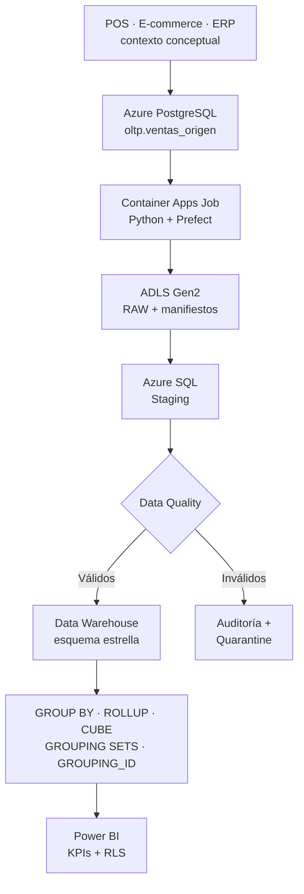

# Comercial Andina Data Platform

Plataforma analítica de ventas basada en Data Warehousing, calidad de datos, ETL,
consultas OLAP y Power BI para Comercial Andina S.A.

La PoC implementa en Microsoft Azure el alcance completo del laboratorio y lo amplía
con trazabilidad, RAW inmutable, cuarentena, reconciliación, Prefect, infraestructura
como código, observabilidad, seguridad y CI/CD sin almacenar credenciales en GitHub.

## Arquitectura definitiva



Microsoft Entra ID, Azure RBAC, Managed Identity, Key Vault, Azure Monitor,
Log Analytics, GitHub Actions y las tablas de auditoría actúan transversalmente.
El alcance técnico evaluado comienza en `oltp.ventas_origen`; POS, e-commerce y ERP
explican su origen empresarial.

## Alcance verificable

| Elemento | Implementación |
|---|---|
| Fuente | Azure Database for PostgreSQL, siete campos exactos del laboratorio |
| Dataset | 10 000 ventas sintéticas reproducibles |
| Cobertura | 20 productos, 5 categorías, 5 regiones y 3 años |
| Calidad | 8 reglas y 20 registros inválidos controlados |
| Trazabilidad | `batch_id`, manifiesto, SHA-256 y timestamps |
| Lake | ADLS Gen2 con contenedores `raw`, `manifests` y `quarantine` |
| DW | Azure SQL: `dim_fecha`, `dim_producto`, `dim_region`, `fact_ventas` |
| OLAP | `GROUP BY`, `ROLLUP`, `CUBE`, `GROUPING SETS`, `GROUPING_ID` |
| Orquestación | Prefect con seis tareas, estados, logs y reintentos |
| Consumo | Power BI Import, KPIs, tres visuales obligatorios y RLS |
| Automatización | Bicep + GitHub Actions + OIDC sin claves permanentes |

## Cumplimiento del laboratorio

| Requisito | Evidencia versionada |
|---|---|
| Crear y poblar `ventas_origen` | `sql/postgres/` y generador Python |
| Calcular `total_venta` | `etl.sp_procesar_lote` |
| Validar cantidad y precio positivos | reglas `DQ-005` y `DQ-006` |
| `GROUP BY` | `sql/olap/01_*` y `02_*` |
| `ROLLUP(region, producto)` | `sql/olap/03_rollup_region_product.sql` |
| `CUBE(region, categoria, mes)` | `sql/olap/04_cube_region_category_month.sql` |
| Barras, línea y matriz | `powerbi/SEMANTIC_MODEL.md` |

## Estructura

```text
.
├── .github/                 CI, CodeQL, Dependabot y despliegue Azure
├── config/                  Data Contract y catálogos maestros
├── infra/bicep/             plataforma y Container Apps Jobs
├── powerbi/                 modelo semántico, DAX, páginas y RLS
├── sql/
│   ├── postgres/            fuente operacional consolidada
│   ├── azure_sql/           Staging, DQ, DW, auditoría y vistas
│   └── olap/                consultas obligatorias y adicionales
├── src/comercial_andina/    generador, ETL, Azure y flujo Prefect
├── tests/                   contrato, datos, seguridad y regresión
├── DEPLOYMENT.md            implementación y evidencias paso a paso
└── Dockerfile               imagen no-root del pipeline
```

## Desarrollo local

```bash
python -m venv .venv
source .venv/bin/activate
python -m pip install --upgrade pip
python -m pip install -e ".[dev]"
ruff check .
pytest
comercial-andina generate --records 10000
```

En PowerShell, la activación es `.\.venv\Scripts\Activate.ps1`; en Git Bash,
`source .venv/Scripts/activate`.

## Seguridad y límites

- No se versionan contraseñas, API keys, tokens, archivos `.env` ni datos generados.
- GitHub Actions usa OIDC y credenciales temporales de Azure.
- Las cargas usan TLS, Key Vault, RBAC y Managed Identity.
- ADLS bloquea acceso anónimo y usa autenticación Entra ID.
- La PoC contiene exclusivamente datos ficticios y no es una plataforma bancaria
  productiva; la evolución enterprise incorpora Private Endpoints y redes privadas.

La ejecución completa y las evidencias se describen en [DEPLOYMENT.md](DEPLOYMENT.md).
