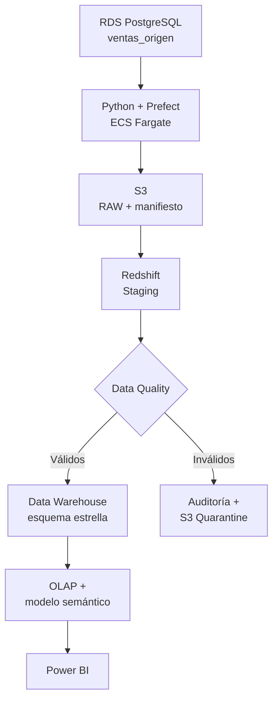

# Comercial Andina Data Platform

Plataforma analítica de ventas basada en Data Warehousing, calidad de datos, ETL,
consultas OLAP y Power BI para Comercial Andina S.A.

La solución implementa una PoC trazable sobre AWS. Conserva exactamente el alcance
académico de `ventas_origen`, `GROUP BY`, `ROLLUP`, `CUBE` y Power BI, y lo amplía
con patrones profesionales: RAW inmutable, manifiestos, cuarentena, reconciliación,
orquestación, infraestructura como código, seguridad y CI/CD.

## Flujo definitivo



IAM, KMS, Secrets Manager, CloudWatch, GitHub Actions y las tablas de auditoría
actúan como controles transversales. POS, e-commerce y ERP forman parte del contexto
de negocio; el alcance técnico evaluado comienza en `oltp.ventas_origen`.

## Alcance de la PoC

| Elemento | Definición |
|---|---|
| Fuente oficial | `oltp.ventas_origen` en Amazon RDS for PostgreSQL |
| Datos | 10 000 ventas sintéticas reproducibles |
| Cobertura | 20 productos, 5 categorías, 5 regiones y 3 años |
| Frecuencia | Lote diario D+1, zona `America/Lima` |
| Calidad | 8 reglas y 20 rechazos controlados |
| RAW | CSV, manifiesto, checksum SHA-256 y metadatos en S3 |
| DW | `dim_fecha`, `dim_producto`, `dim_region`, `fact_ventas` |
| OLAP | `GROUP BY`, `ROLLUP`, `CUBE`, `GROUPING SETS`, `GROUPING_ID` |
| Consumo | Power BI Import, KPIs, tres visuales obligatorios y RLS |
| Orquestación | Prefect con seis tareas observables y reintentos por etapa |

## Cumplimiento del laboratorio

| Requisito | Implementación |
|---|---|
| Fuente con siete campos | `sql/rds/01_create_source.sql` y contrato JSON |
| Calcular `total_venta` | procedimiento `etl.sp_procesar_lote` |
| Validar cantidad y precio > 0 | reglas `DQ-005` y `DQ-006` |
| `GROUP BY` | `sql/olap/01_*` y `02_*` |
| `ROLLUP(region, producto)` | `sql/olap/03_rollup_region_product.sql` |
| `CUBE(region, categoria, mes)` | `sql/olap/04_cube_region_category_month.sql` |
| Barras, línea y matriz | `powerbi/SEMANTIC_MODEL.md` |

## Estructura

```text
.
├── .github/                 CI, CodeQL, Dependabot y gobierno de PR
├── config/                  contrato y catálogos maestros
├── infra/cloudformation/    red, datos y cómputo AWS
├── powerbi/                 especificación semántica, DAX y RLS
├── sql/
│   ├── rds/                 fuente operacional
│   ├── redshift/            staging, DQ, DW, auditoría y vistas
│   └── olap/                consultas obligatorias y adicionales
├── src/comercial_andina/    generador, ETL, AWS y flujo Prefect
├── tests/                   contrato, datos, seguridad y regresión
├── DEPLOYMENT.md            implementación y evidencias paso a paso
├── Dockerfile               imagen del worker
└── prefect.yaml             despliegue y horario D+1
```

## Inicio local

Se requiere Python 3.11 o superior.

```bash
python -m venv .venv
source .venv/bin/activate
python -m pip install --upgrade pip
python -m pip install -e ".[dev]"
ruff check .
pytest
comercial-andina generate
```

En Windows PowerShell, activar con `.\.venv\Scripts\Activate.ps1`. En Git Bash,
usar `source .venv/Scripts/activate`.

## Comandos principales

```bash
# Generar el dataset y su manifiesto
comercial-andina generate --records 10000

# Crear/cargar la fuente privada RDS
comercial-andina load-rds --host HOST --secret-arn ARN

# Construir objetos de Redshift
comercial-andina bootstrap-redshift --workgroup WORKGROUP --secret-arn ARN

# Ejecutar un lote end-to-end usando variables de entorno
comercial-andina run-pipeline --batch-id BATCH-20260901-001
```

La guía completa está en [DEPLOYMENT.md](DEPLOYMENT.md).

## Gobierno y seguridad

- Ninguna contraseña, API key, archivo `.env` o credencial AWS se versiona.
- Los despliegues AWS son manuales, usan OIDC y credenciales temporales.
- RDS y Redshift son privados; S3 bloquea acceso público y cifra con KMS.
- Todo cambio entra mediante Pull Request y debe superar lint, pruebas,
  CloudFormation lint, build del contenedor y CodeQL.
- La PoC usa datos ficticios y no constituye una plataforma bancaria certificada.

## Qué no se almacena en GitHub

El repositorio contiene todo el material reproducible. No contiene secretos, el CSV
generado, capturas con datos sensibles ni el archivo binario `.pbix`. El `.pbix` se
crea en Power BI Desktop siguiendo la especificación versionada y se conserva como
evidencia académica fuera del control de código.
